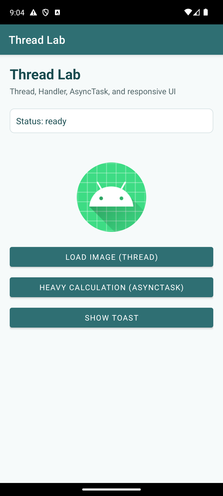
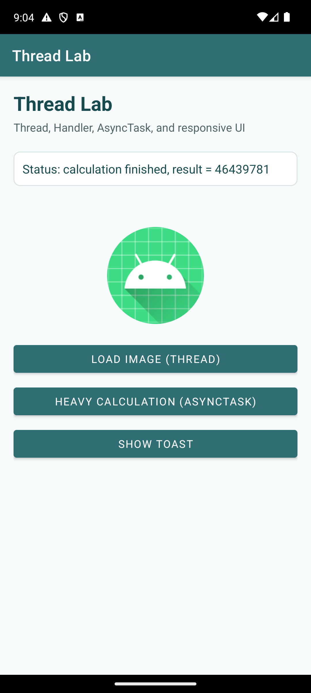

# Thread Lab

A small Android app for practicing background work with `Thread`, `Handler`, and `AsyncTask` while keeping the interface responsive.

<p>
  
  
</p>

## Overview

Thread Lab is built with Java and XML layouts. It demonstrates how long-running work can run outside the main UI thread, then return safely to update views such as `TextView`, `ImageView`, and `ProgressBar`.

## Features

- Load an image through a worker `Thread`.
- Update the UI safely with `Handler`.
- Run a simulated heavy calculation with `AsyncTask`.
- Publish progress to a horizontal progress bar.
- Keep a Toast button responsive during background work.
- Display clear status messages for each operation.

## Tech Stack

- Java
- Android SDK
- XML layouts
- AppCompat
- Material Components
- Gradle

## App Screens

### Ready State

The main screen shows the status panel, progress bar, image preview, and the three lab action buttons.

### AsyncTask Result

After the heavy calculation finishes, the app displays the computed result without freezing the interface.

## Project Structure

```text
app/src/main/
  java/com/example/lab08/
    MainActivity.java
  res/layout/
    activity_main.xml
  res/values/
    strings.xml
    themes.xml
```

## Implementation

`MainActivity` creates a `Handler` for main-thread updates, starts a worker `Thread` for image loading, and uses `AsyncTask` to simulate a long calculation with progress updates.

## Build

```powershell
.\gradlew.bat assembleDebug
```
